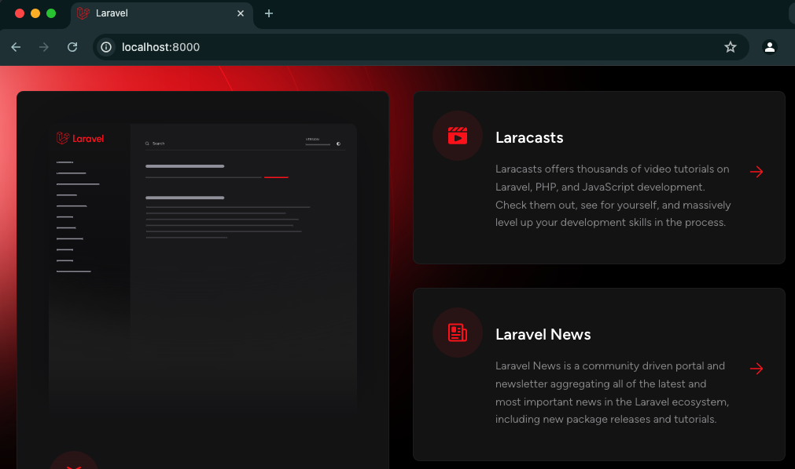

# Docker Laravel + SqlServer
En este proyecto se comparte un archivo docker compose con los servicios de Laravel y Sql Server de tal manera que puedan ser ejecutados ambos contenedores.

Para el servicio Laravel se ha configurado un archivo Dockerfile que permite instalar en la dicho contenedor Laravel todas las extensiones necesarias para que funcione los controladores de sqlserver.

## Imágenes
Este proyecto usa las siguientes imágenes
* Laravel: [bitnami/laravel:11](https://hub.docker.com/layers/bitnami/laravel/11/images/sha256-e2d06daf053623c8a9db3d1d6382ce35c0ae269a1e7e80a82a430b47cfe85ef9?context=explore)
* SqlServer: [mcr.microsoft.com/mssql/server:2022-latest](https://hub.docker.com/r/microsoft/mssql-server)

## Setup
Para levantar estos contenedores se tiene que ejecutar con el siguiente comando en la carpeta donde se encuentre este proyecto
```
docker compose up -d
```

Dentro de carpeta `src/` se copiará el proyecto app, en el cual tendremos que buscar el fichero `.env` y modificar las siguientes lineas. Ejemplo:
```
DB_CONNECTION=sqlsrv
DB_HOST=sqlserver
DB_PORT=1433
DB_DATABASE=laravel_db
DB_USERNAME=sa
DB_PASSWORD=MiPassword2024
```

Existen diferentes formas de como ingresar a un contenedor, y de seguro la que mas conocen es `docker exec -it ID_DE_MI_IMAGEN bash` . En este caso, aprovechando que estamos usando docker compose usaremos los servicios definidos en el archivo `docker-compose.yml` para poder acceder a los contenedores.

Ingresamos al contenedor de la BD cuyo nonbre definido en el servicio es sqlserver
```
docker compose exec sqlserver bash
```

Una vez dentro ejecutamos los siguientes comandos para crear una base de datos
```
/opt/mssql-tools/bin/sqlcmd -S localhost -U sa -P MiPassword2024

CREATE DATABASE laravel_db;
GO
```

Salimos e ingresamos al siguiente contenedor de Laravel
```
docker compose exec laravel bash
```

Una vez dentro ejecutamos los siguientes comandos para hacer la migracion por defecto de laravel, el cual si pasa sin errores, la configuración es correcta
```
php artisan migrate
```

De esta manera al ingresar al siguiente enlace http://localhost:8000 vamos a visualizar lo siguiente




